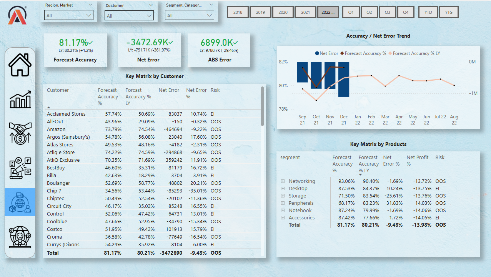
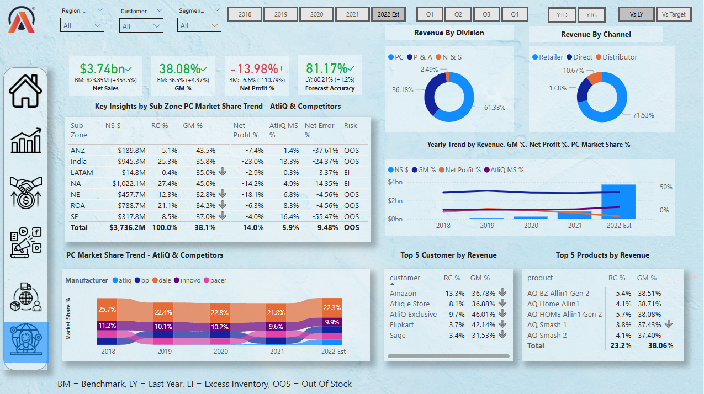

# 📊 Business Insights 360

Power BI Data Analysis Project

---

## 📌 Project Overview

AtliQ Hardware is a rapidly growing company that has decided to implement data analytics using Power BI to outperform competitors and make data-driven decisions.

This project focuses on answering key stakeholder questions across domains like finance, sales, marketing, and supply chain.

🔗 **Live Report:(https://tinyurl.com/mvmuj5p8)** 

---

## 🛠️ Tools Used

* SQL
* Power BI Desktop
* Excel
* DAX
* DAX Studio

---

## 📊 Power BI Techniques Learned

* Asking the right business questions before starting a project
* Creating calculated columns
* Creating measures using DAX
* Data modeling (Star Schema)
* Using bookmarks for switching visuals
* Page navigation with buttons
* Using DIVIDE function to avoid zero division errors
* Creating date table using M language
* Dynamic titles based on filters
* KPI indicators
* Conditional formatting (icons & colors)
* Data validation techniques
* Power BI Service
* Publishing reports
* Setting up personal gateway for auto-refresh
* Power BI App creation
* Workspace collaboration & access permissions

---

## 🌍 Domain Knowledge

* Finance
* Sales
* Marketing
* Supply Chain

---

## 🧠 DAX Functions Used

* CALCULATE()
* DIVIDE()
* FILTER()
* SWITCH()

---

## 📈 Business Terminology

* Gross Price
* Pre-invoice Deductions
* Post-invoice Deductions
* Net Invoice Sales
* Gross Margin
* Net Sales
* Net Profit
* COGS (Cost of Goods Sold)
* YTD (Year to Date)
* YTG (Year to Go)
* Direct / Retailer / Distributor / Consumer

---

## 🏢 Company Background

AtliQ Hardware is a global company selling computers and accessories through:

* Retailers
* Direct channels
* Distributors

The company faced losses in a new market due to decisions based on intuition and limited Excel analysis, while competitors used strong analytics teams.

This project helps build a data-driven approach using Power BI.

---

## ❓ Questions Before Building Dashboard

* What is the objective of this dashboard?
* How will success be measured?
* What is the timeline?
* Do stakeholders need a preview before release?
* What are stakeholder expectations and fears?
* Who will use the dashboard and for what purpose?
* What can go wrong?
* What data/resources are required?
* Any design inputs from stakeholders?

---

## 🔌 Data Import

* Data is imported from MySQL into Power BI using database credentials

---

## 🎨 Dashboard Design

Dashboard is built based on stakeholder mockups and business requirements

---

## 📸 Dashboard Preview

### 🏠 Home View

### 💰 Finance View
 

### 📊 Sales View

### 📣 Marketing View

### 🚚 Supply Chain View

### 👔 Executive View

### 🛠️ Support View

---

## 📎 Report Access

🔗 https://tinyurl.com/mvmuj5p8

---

## 🎯 Project Outcome

This dashboard enables data-driven decision-making and helps stakeholders answer multiple business questions effectively.

