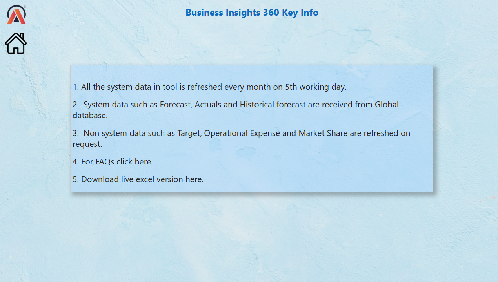
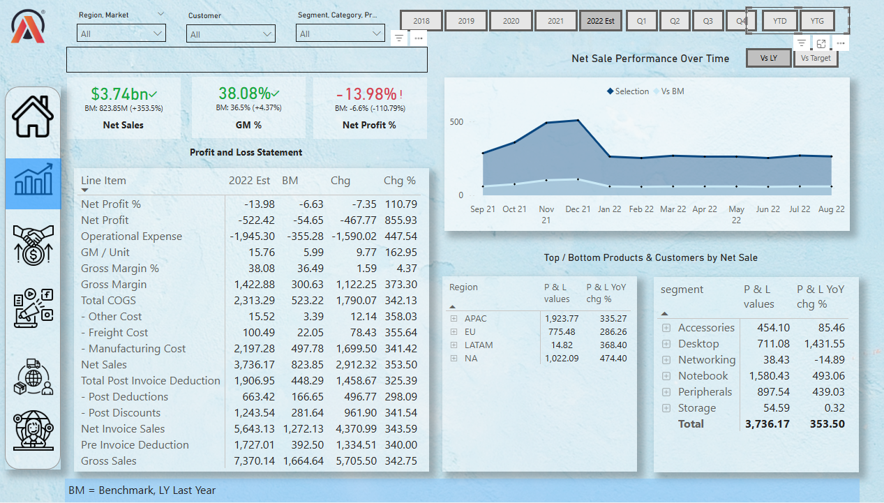
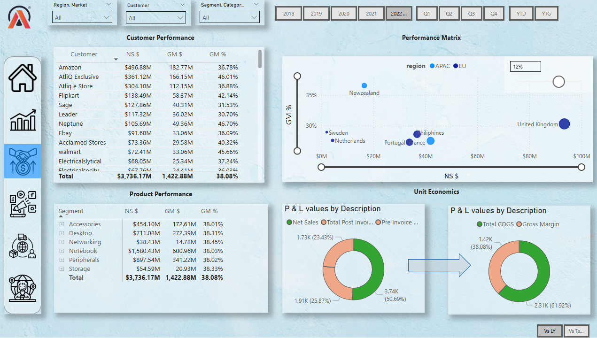
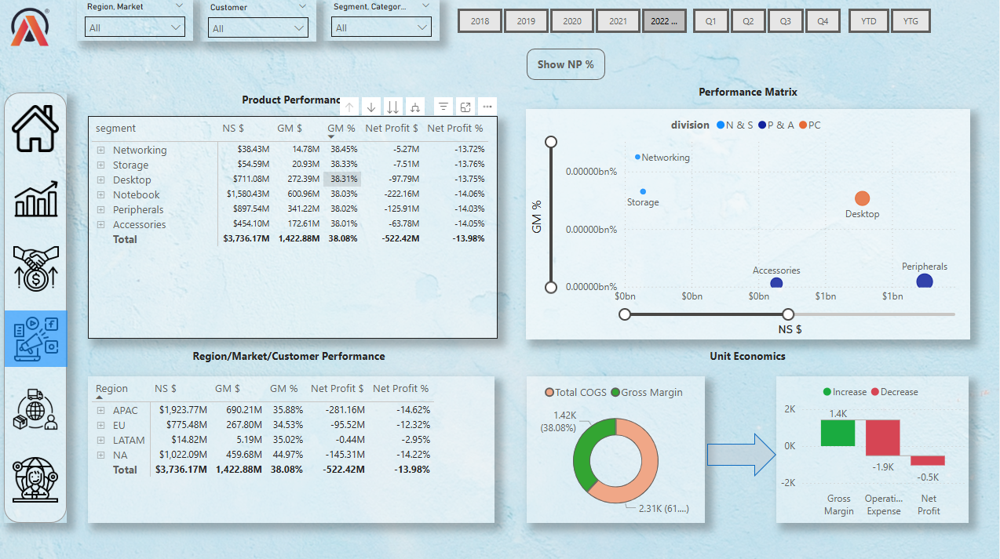
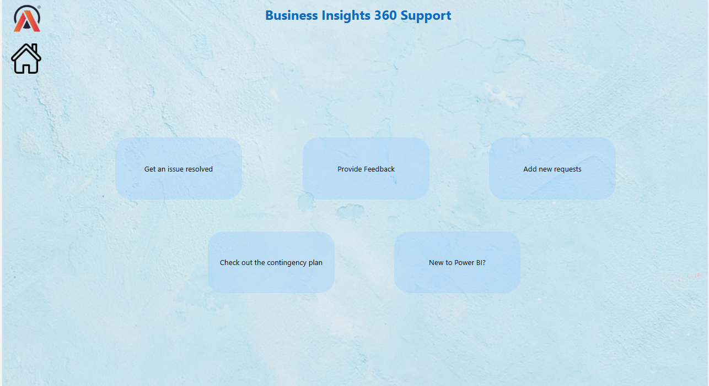

# Business-Insights-360
Power Bi Data Analysis Project  : Business Insights 360

## Project Overview

AtliQ Hardware is growing rapidly in the recent years, and they have decided to implement the data analytics using PowerBi in their company for the first time to surpass their competitors in the market and to make data driven decisions. This project is hoped to give answers to the questions of stakeholder in terms all the aspects like finance, sales, marketing and supply chain.

I worked on this project by following the Codebasics PowerBi Course, Link to the course is [here](https://codebasics.io/courses/power-bi-data-analysis-with-end-to-end-project)

[Live Report Link](https://tinyurl.com/mvmuj5p8)

## Tools Used

- SQL
- Power BI Desktop
- Excel
- DAX language
- DAX studio (for optimizing the report)

## PowerBI techniques Learnt

- What are all the questions should be asked before staring the project
- Creating calculated columns
- creating measure using DAX language
- Data modeling
- Using Bookmarks to switch between two visuals
- Page navigation with buttons
- Using divide function to prevent zero division errors
- creating date table using m language
- Dynamic titles based on the applied filters
- Using KPI indicators
- Conditional formatting the values in visuals using icons or background color
- Data validation techniques
- PowerBi services
- Publishing reports to PowerBi services
- Setting up personal gateway to set up the auto refresh of data
- PowerBi App creation
- Collaboration, workspace, access permissions in PowerBi services

## Domain Knowledge

- Finance
- Sales
- Marketing
- Supply Chain 

## DAX Functions

- CALCULATE ( )
- DIVIDE ( )
- FILTER ( )
- SWITCH ( )

## Business related terms

- Gross price
- Pre-invoice deductions
- Post-Invoice deductions
- Net Invoice sale
- Gross Margin
- Net sales
- Net profit
- COGC - cost of goods sold
- YTD - Year to Date
- YTG - Year to Go
- Direct
- Retailer
- Distributors
- Consumer

## Company’s background

AltiQ hardware is a company which has grown vastly in the recent years, and opened business all over the globe. It is a company which sells, computer and computer accessories through three mediums/channel

- Retailers
- Direct
- Distributors

Recently the company has faced a unforeseen loss by opening store in America based on the surveys, intuition and some excel analysis and also the company’s competitors has handful of analytics team to perform analysis and make data driven decision. So, the AltiQ hardware has no other option other than building their analytics team for data driven insights and decisions in the future to survive better in the industry. 

Project kick off session, where you should get clear of for what and why this project and all other questions you have with regards to the project

### Questions to ask before starting with dashboard

- What is the objective of building this PowerBi dashboard?
- In what terms the success of this project will be measured?
- What will be time dead-line of the project?
- do the stakeholders expecting pre-view before the actual release?
- What are all the hopes stakeholders have out of this project?
- what are all fears the stakeholder have in terms of building this dashboard?
- Who are all will be using this dashboard and for what purpose?
- what are all expectation the stakeholders have, by the completion of this project?
- What can go wrong while building this project?
- what are all the resources/ data needed to build this dashboard?
- is there any inputs from stakeholders in terms of design and views of the dashboard?

After the project kick off meetings, the data engineering team has given the data as per the request of data analytics team, let’s explore them.

## Importing data into PowerBi

- As the database is MySQL in this project, we need to import the datasets from Mysql database to PowerBi by providing the Database access credential

### Dashboard designing

Based on the mock ups received as requirement, the team will start designing the visuals and create measure as and when required

## Home view

In Home view, all the views button will be available. User will land on specific view page by clicking the button 

# Info

# Finance View

# Sales View

# Marketing View

# Supply chain View 

# Executive View 

# Support
- 

you can find the full report file here : [Report](https://tinyurl.com/mvmuj5p8)

## Project Outcome

By using this report, decisions can be taken based on the data. Further it will help in answering n number of why questions based on the situations.

# -----------------------------------------------------------------------------------------------------------------

# 📊 Business Insights 360

Power BI Data Analysis Project

---

## 📌 Project Overview

AtliQ Hardware is a rapidly growing company that has decided to implement data analytics using Power BI to outperform competitors and make data-driven decisions.

This project focuses on answering key stakeholder questions across domains like finance, sales, marketing, and supply chain.

🔗 **Live Report:** https://tinyurl.com/mvmuj5p8

---

## 🛠️ Tools Used

* SQL
* Power BI Desktop
* Excel
* DAX
* DAX Studio

---

## 📊 Power BI Techniques Learned

* Asking the right business questions before starting a project
* Creating calculated columns
* Creating measures using DAX
* Data modeling (Star Schema)
* Using bookmarks for switching visuals
* Page navigation with buttons
* Using DIVIDE function to avoid zero division errors
* Creating date table using M language
* Dynamic titles based on filters
* KPI indicators
* Conditional formatting (icons & colors)
* Data validation techniques
* Power BI Service
* Publishing reports
* Setting up personal gateway for auto-refresh
* Power BI App creation
* Workspace collaboration & access permissions

---

## 🌍 Domain Knowledge

* Finance
* Sales
* Marketing
* Supply Chain

---

## 🧠 DAX Functions Used

* CALCULATE()
* DIVIDE()
* FILTER()
* SWITCH()

---

## 📈 Business Terminology

* Gross Price
* Pre-invoice Deductions
* Post-invoice Deductions
* Net Invoice Sales
* Gross Margin
* Net Sales
* Net Profit
* COGS (Cost of Goods Sold)
* YTD (Year to Date)
* YTG (Year to Go)
* Direct / Retailer / Distributor / Consumer

---

## 🏢 Company Background

AtliQ Hardware is a global company selling computers and accessories through:

* Retailers
* Direct channels
* Distributors

The company faced losses in a new market due to decisions based on intuition and limited Excel analysis, while competitors used strong analytics teams.

This project helps build a data-driven approach using Power BI.

---

## ❓ Questions Before Building Dashboard

* What is the objective of this dashboard?
* How will success be measured?
* What is the timeline?
* Do stakeholders need a preview before release?
* What are stakeholder expectations and fears?
* Who will use the dashboard and for what purpose?
* What can go wrong?
* What data/resources are required?
* Any design inputs from stakeholders?

---

## 🔌 Data Import

* Data is imported from MySQL into Power BI using database credentials

---

## 🎨 Dashboard Design

Dashboard is built based on stakeholder mockups and business requirements

---

## 📸 Dashboard Preview

### 🏠 Home View

### 💰 Finance View

### 📊 Sales View

### 📣 Marketing View

### 🚚 Supply Chain View

### 👔 Executive View

### 🛠️ Support View

---

## 📎 Report Access

🔗 https://tinyurl.com/mvmuj5p8

---

## 🎯 Project Outcome

This dashboard enables data-driven decision-making and helps stakeholders answer multiple business questions effectively.

